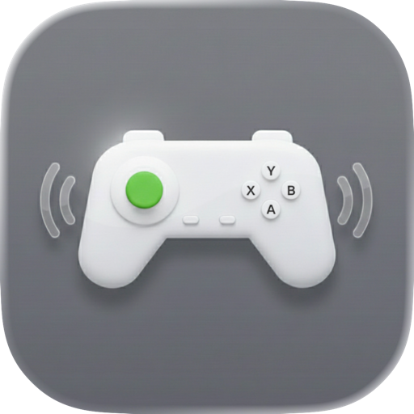
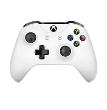

# 🎮 MacConRum
### Advanced Controller Haptics for macOS

---

## 🌟 What is MacConRum?

**MacConRum** is a powerful macOS utility that brings immersive haptic feedback to your gaming sessions. Whether you're playing games that don't natively support controller vibration or want to enhance your existing gaming experience, MacConRum intelligently analyzes audio and gameplay to deliver precise, customizable vibration feedback to your PlayStation DualSense or Xbox controllers.

### ✨ Key Highlights

- 🎯 **Three Intelligent Modes**: Audio Analysis, and Manual Button Mapping
- 🎮 **Universal Controller Support**: Works seamlessly with DualSense and Xbox controllers
- 🎵 **Real-time Audio Analysis**: FFT-based bass detection for dynamic vibration
- 🔧 **Fully Customizable**: Fine-tune intensity, duration, and sensitivity for every game
- 📊 **Visual Feedback**: Real-time audio level visualization and status monitoring
- 🌐 **Game Profiles**: Pre-configured profiles for popular games with Firebase integration

---

## 🚀 Features

### 🎵 Audio Analysis Mode
Transform your game's audio into haptic feedback in real-time.

- **FFT-Based Bass Detection**: Analyzes low-frequency audio (20-100Hz configurable)
- **Virtual Audio Device Support**: Compatible with BlackHole and other virtual audio devices
- **Adjustable Sensitivity**: Fine-tune threshold and intensity to match your preferences
- **Real-time Visualization**: Monitor audio levels and vibration intensity live
- **Multi-Output Support**: Listen to game audio while analyzing it simultaneously

**Perfect for**: Racing games, action games, rhythm games, and any title with dynamic audio

### 🕹️ Button Mapping Mode
Manual control for precise haptic feedback.

- **Per-Button Configuration**: Set unique vibration for each button and trigger
- **Adjustable Intensity & Duration**: Fine-tune feedback strength and length
- **Trigger Pressure Sensitivity**: Adaptive intensity based on trigger pressure
- **Profile Management**: Save and load button mapping configurations
- **Custom Intensity Control**: Adjust vibration strength for each mapped button

**Perfect for**: Fighting games, platformers, games requiring precise feedback control

---

## 🎮 Supported Controllers

<table>
<tr>
<td align="center" width="50%">
 
<b>PlayStation DualSense</b> 
Wireless via Bluetooth
</td>
<td align="center" width="50%">
 
<b>Xbox Wireless Controller</b> 
Wireless via Bluetooth
</td>
</tr>
<tr>
<td align="center" width="50%">
 
<b>8BitDo Controllers</b> 
Wireless via Bluetooth
</td>
<td align="center" width="50%">
<b>Generic HID Controllers</b> 
Most Bluetooth-enabled game controllers 
with vibration support
</td>
</tr>
</table>

---

## 📋 System Requirements

- **Operating System**: macOS 13.5 (Ventura) or later
- **Hardware**: Bluetooth-enabled Mac
- **Optional**: Virtual audio device (e.g., [BlackHole](https://github.com/ExistentialAudio/BlackHole)) for Audio Analysis Mode

---
## 📥 Installation

### Quick Install (Recommended)

1. **Download** the latest `MacConRum.dmg` from the [Releases](../../releases) page
2. **Open** the DMG file by double-clicking it
3. **Drag** `MacConRum.app` to your Applications folder
4. **Launch** the app
